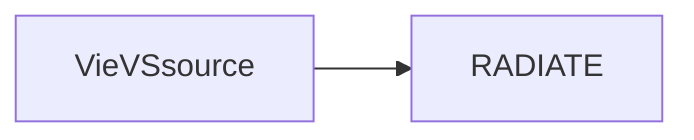

# RADIATE

RADIATE is a ray-tracing software written in Fortran. Ray-traced delays can be calculated for observations in the microwave as well as in the optical frequency range. The computation is based on numerical weather models and the output files contain several tropospheric parameters

# LICENSE

VieVS Ray-tracer (RADIATE)

Copyright (C) 2018 Daniel Landskron
This program is free software: you can redistribute it and/or modify it under the terms of the GNU General Public License as published by the Free Software Foundation, either version 3 of the License, or (at your option) any later version.
This program is distributed in the hope that it will be useful, but WITHOUT ANY WARRANTY; without even the implied warranty of MERCHANTABILITY or FITNESS FOR A PARTICULAR PURPOSE. See the GNU General Public License for more details.
You should have received a copy of the GNU General Public License along with this program. If not, see http://www.gnu.org/licenses/.


## Software requirements

RADIATE is a Fortran-written software to run from Linux command line (Terminal). To compile the software, the 'gfortran 5 compiler' (or newer version) needs to be installed.


## Dependencies

RADIATE is an independent software package of VieVS.


## Installation

For installation the following steps are required:
* Create a directory, for example 'VieVSsource'
* Clone the VieVS module RADIATE into the new directory using

```
$ cd your_directory/VieVSsource
$ git clone git@git.geo.tuwien.ac.at:vievs/RADIATE/RADIATE.git
```

The resulting folder structure should look the following:




## Further information

You can find more detailed information on how to run RADIATE in the [VieVS Wiki] (http://vievswiki.geo.tuwien.ac.at/doku.php?id=internal:vievs_raytracer&s[]=radiate).